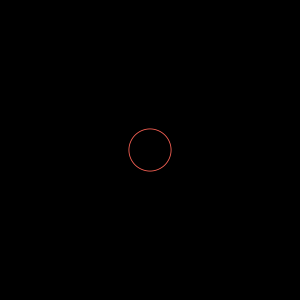
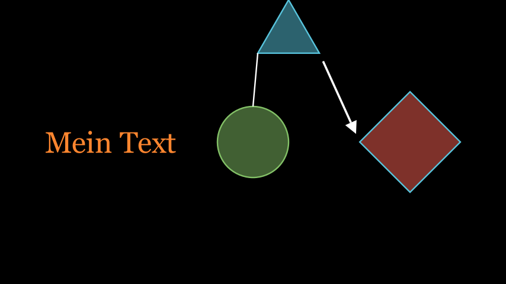
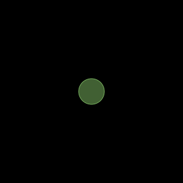
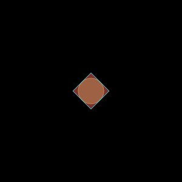
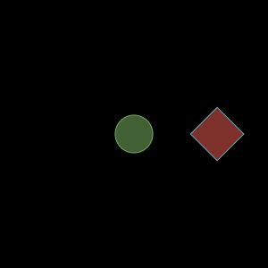
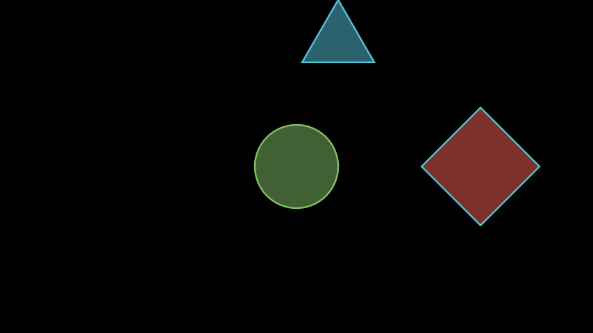
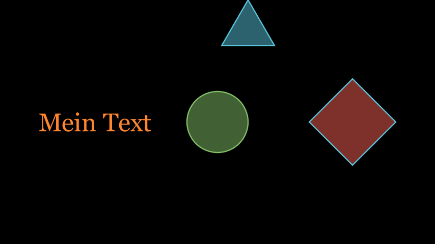

# Grundlagen von Manim

## Erste Szene erstellen

Nachdem Manim im letzten Kapitel installiert wurde, gilt es nun die Grundlagen von Manim zu verstehen um eine erste eigene Szene zu erzeugen.

Zu diesem Zweg macht es Sinn sich erstmal ein sehr einfachen Codeteil anzusehen. Mit dem folgenden Code wird ein einfacher Kreis erzeugt und dargestellt.



```python
from manim import *

class basic(Scene):

    def construct(self):

        circle = Circle()   #Create circle

        self.add(circle)    #Add circle to scene

        # self.wait(1)
```

Die grundlegende Struktur die in dem Code zu sehen ist ist immer die gleiche. Zuerst wird eine Klasse erzeugt, der Name dieser Klasse ist frei wählbar, sollte aber möglichst die Szene repräsentieren. In diesem fall heist die Szene "basic". Als nächstes wird angegeben von welcher bestehenden Klassen die neue Klassse erben soll. In diesem Fall werden die eigenschaften und Funktionen der Klasse ```Scene``` geerbt. Für die meisten 2D-Szenen reicht es ```Scene``` zu wählen, es gibt aber auch andere Szenen-Klassen von denen geerbt werden kann um verschiedene Dinge umzusetzten, die wichtigsten sind folgende:

- ```Scene``` - Einfache 2D Szenen
- ```ZoomedScene``` - 2D Szenen mit Zoomefekten
- ```MovingCameraScene``` - 2D Szene in der die Kamera frei Animiert werden kann
- ```ThreeDScene``` - 3D Szenen

Die hier genanten Szenen stellen lediglich eine Auswahl an wichtigen Szenen dar, es gibt noch viele weitere Szenen-Klassen für verschiedene Spezialfälle. Ein vollständige Liste aller Szenen-Klassen findet sich [hier](https://docs.manim.community/en/stable/reference_index/scenes.html) in der Manim-Doku. 

Ist nun eine Klasse für die zu erzeugende Szene definiert gilt die Methode ```construct()``` zu überschreiben. Dazu wird, wie im Code zu sehen, einfach eine Funktion mit der Signatur ```construct(self)``` definiert. In dieser Funktion wird in der Regel der gesamte Code für das erzeugen der Szene geschrieben.

Ist es nötig Code auszuführen bevor ```construct()``` aufgerufen wird, kann zusätzlich noch die Methode ```setup()``` überschrieben werden. ```setup()``` wird immer vor ```construct()``` ausgeführt.

In der ```construct()``` Methode kann nun Code geschrieben werden um Objekte zu erzeugen. In Manim sind eine Vielzahl an Objekten vordefiniert die über ihre entsprechenden Klassen aufgrufen werden können. Alle Objekte lassen sich grundsätzlich auf die Klasse ```Mobject``` zurückführen. Eine übersicht aller Mobjects findet sich [hier](https://docs.manim.community/en/stable/reference_index/mobjects.html).

In diesem Fall wird die Klasse ```Circle()``` verwendet um einen einfachen Kreis zu erzeugen. Ein erzeugtes Objekt wird allerdings nicht automatisch auch auf dem Bild angezeigt. Um Objecte dem Bild hinzuzufügen wird die Methode ```add()``` der Szenen-Klasse verwendet. Diese fügt statische Objekte dem Bild hinzu. Grundlegend ist nun eine sehr einfache Szene bereits fertig und kann gerendert werden. Da nur mit ```self.add()``` gearbeitet wurde wird nur ein einzelnes Bild und kein Video erzeugt. Insbesondere wenn das VS-Code Plugin "Manim Sideview" verwendet wird empfieht es sich allerdings immer Videos zu erstellen da "Manim Sideview" Probleme damit hat einzelne Bilder darzustellen. Zu diesem Zweg kann am Ende noch die Methode ```wait()``` verwendet werden. Mit ```wait()``` kann ganz einfach eine Wartezeit eingefügt werden. In diesem fall wird dadurch aus dem Bild nun ein Video mit der in  ```wait()``` angegebenen Länge.

Aber wie genau wird aus dem Code nun ein Bild oder Video erzeugt? Um den Render-Vorgang zu starten wird eine Komandozeile benötigt. Um eine Szene zu Rendern wird grundlegend nur ein einfacher Befehl benötigt: ```manim pfad\zur\datei.py nameDerKlasse```. Vorrausgesetzt die Komandozeile befindet sich bereits im gleichen Ordner in dem die Pythondatei ligt sieht der Befehl für das Codebeispiel dann so aus: ```manim basics.py basic```. Die gerenderte Szene befindet sich nun in einem der folgenden Ordner:

- Video: .\media\videos\\[NameDerSzene]\\[Auflösung]\ - in diesem Fall zum Beispiel: .\media\videos\basics\480p15\basic.mp4
- Bild: .\\media\images\\[NameDerSzene]\ - in diesem Fall zum Beispiel: .\media\images\basics\basic_ManimCE_v0.14.0.png

Verschiedene Aspekte des Renderprozesses können mithilfe von CLI Flags angepasst werden. Eine vollständige List aller möglichen Flags findet sich [hier](https://docs.manim.community/en/stable/tutorials/configuration.html). Einige wichtige CLI Flags sind folgdene:

- ```--format``` - mögliche Optionen: png, gif, mp4, webm, mov
- ```-q```, ```--quality``` - mögliche Optionen: 
    - ```l``` - 854x480 15FPS
    - ```m``` - 1280x720 30FPS
    - ```h``` - 1920x1080 60FPS
    - ```p``` - 2560x1440 60FPS
    - ```k``` - 3840x2160 60FPS
- ```-r```, ```--resolution``` - manuelle Angabe der Auflösung in ```width,hight```
- ```--fps```, ```--frame_rate``` - manuelle Angabe der Frame Rate als Float

## Zweite Szene
Nachdem nun eine erste eigenen Szene erstellt wurde gibt es noch einige weitere Grundlagen die nun in dieser zweiten Szene dargestellt werden. Speziell sollen nun folgende Konzepte betrachtet werden:

- Bearbeiten von Objekten
- Hinzufügen von mehreren Objekten
- Positionierung von Objekten

Ziel ist die folgende Szene:




Zuerst wird nun der Kreis aus der ersten Szene bearbeitet:

```python
from manim import *

class basic(Scene):

    def construct(self):

        circle = Circle()               #Create circle

        circle.set_color(GREEN)         #Change color
        
        circle.set_fill(opacity=0.5)    #change fill

        self.add(circle)                #Add circle to scene

        # self.wait(1)
```

Die Klasse ```Circle()``` erbt von ```VMobject()``` und stellt damit unter anderem die Methoden ```set_color(color)``` und ```set_fill(color, opacity)``` zur verfügung. ```set_color()``` setzt dabei auch automatisch die Füllfarbe, da die ```opacity```allerdings standartmäßig auf 0 gesetzt ist muss dieser Wert angepasst werden. Die Farbe kann grundlegend mithilfe von Hex-Farbcodes angegeben werden, Manim stellt allerdings auch eine Menge an vordefinierten Konstanten zur verfügung. Hier wurde zum Beispiel die Konstante ```GREEN``` verwendet welche den Hex-Farbcode "#83C167" enthält. Eine Liste aller Farb-Konstanten gibt es [hier](https://docs.manim.community/en/stable/reference/manim.utils.color.Colors.html).

Aus dem gezeigten Code ergibt sich nun folgendes:



Als nächstes soll nun ein weiteres Objekt hinzugefügt werden. Mit folgendem Code wird ein Quadrat erstellt, die Farbe verändert und das Quadrat gedreht:

```python
square = Square()                   #create square

square.set_color(BLUE)              #change color

square.set_fill(RED, opacity=0.5)   #change fill

square.rotate(45*DEGREES)           #rotate square
```

Das erstellen des Quadrats und das verändern der Farbe unterscheidet sich nun kaum vom Kreis zuvor. Natürlich wird nun nicht mehr die Klasse ```Circle()``` verwendet sondern eben ```Square()```. Zudem wird in der Methode ```set_fill()``` nun zusätzlich eine Farbe angegeben. Dadurch unterscheiden sich nun die Füllfarbe und die Farbe der Linie des Kreises. Um das Quadrat zu drehen kann die von ```VMobject``` geerbte Methode ```rotate()``` verwendet werden. ```rotate()``` akzeptiert Float-Werte der von PI abhängigen Einheit "Radiant" kurz "rad". Mithilfe der Konstante ```DEGREES``` können Grad-Werte in die entsprechenden Radiant-Werte umgerechnet werden.


Um das neue Quadrat zum Bild hinzuzufügen gibt es zwei möglichkeite.

Hinzufügen mit eigenem add-Statement:
```python
self.add(square)
```

Anpassen des bestehenden add-Statements:
```python
self.add(circle, square)
```

Nun Ergibt sich folgendes:



Das Quadrat wurde korrekt erstellt, befindet sich allerdings noch an der gleichen stelle im Bild wie der Kreis. Es gilt nun das Objekt zu Positionieren. Dazu gibt es in erster Linie drei Methoden die von nahezu allen Objekten in Manim angeboten werden:

- next_to() - Positionierung relativ zu einem anderen Objekt
- shift() - Positionierung relativ zur aktuellen Position
- move_to() - Absolute positionierung

Zur Positionierung werden außerdem noch die folgenden 5 Konstanten benötigt:
- ORIGIN - Mitte
- UP - einen Schritt nach oben
- DOWN - einen Schritt nach unten
- RIGHT - einen Schritt nach rechts
- LEFT - einen Schritt nach links

Diese Konstanten verhalten sich ähnlich wie Vektoren und können so zur absoluten Positionierung als auch zur relativen Positionierung verwendet werden.

Mithilfe dieser infomationen kann das Quadrat nun bewegt werden. Es soll rechts neben dem Kreis angeordnet werden. Dafür wird folgender Code verwendet:

```python
square.next_to(circle, RIGHT, buff=2)
```

Hier wird zusätzlich die Variable ```buff``` verändert um den Abstand zwischen den beiden Objekten zu erhöhen.

Es ergibt sich folgende Grafik:



Um die funktionsweise von ```shift()``` zu zeigen wird nun zuerst wieder ein neues Objekt erzeugt. Der Ablauf unterscheidet sich nicht von zuvor.

```python
triangle = Triangle()
triangle.set_color(BLUE)
triangle.set_fill(opacity=0.5)


self.add(circle, square, triangle)
```

Das nun erstellte Dreieck soll nach rechts ober bewegt werden dazu können die Konstanten kombiniert werden. Mit der ```shift()``` Methode sieht das dann so aus:

```python
triangle.shift(RIGHT + UP*3)
```



Es ist natürlich auch möglich all das in einer einzelnen Zeile zu schreiben. Um dies zu zeigen sowie die Positionierung mit ```move_to()``` zu zeigen wird nun noch ein weiters Objekt erstellt. 

```python
text = Text("Mein Text", font_size=60, color=ORANGE).move_to(LEFT*4)


self.add(circle, square, triangle, text)
```

Das Bild sieht dann so aus:



Nachdem nun die Positionierung von Objekten dargestellt wurde. Sollen noch zwei weitere Objekte kurz gezeigt werden: Linien und Pfeile zwischen Objekten.

Das erstellen einer Linie oder eines Pfeils zwischen zwei Objekten ist sehr einfach und kann jeweils mit einer einzigen Codezeile erreicht werden.

```python
line = Line(triangle, circle)

arrow = Arrow(triangle, square)

self.add(circle, square, triangle, line, arrow, text)
```

Damit ergibt sich nun das Bild vom Anfang:


Wie zu sehen ist stellt Manim eine große Vielfalt an Möglichkeiten zu verfügung die einfach kombiniert werden können um Szenen zu erzeugen. 
