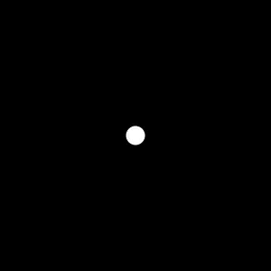
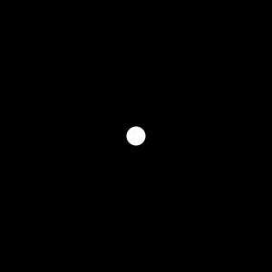
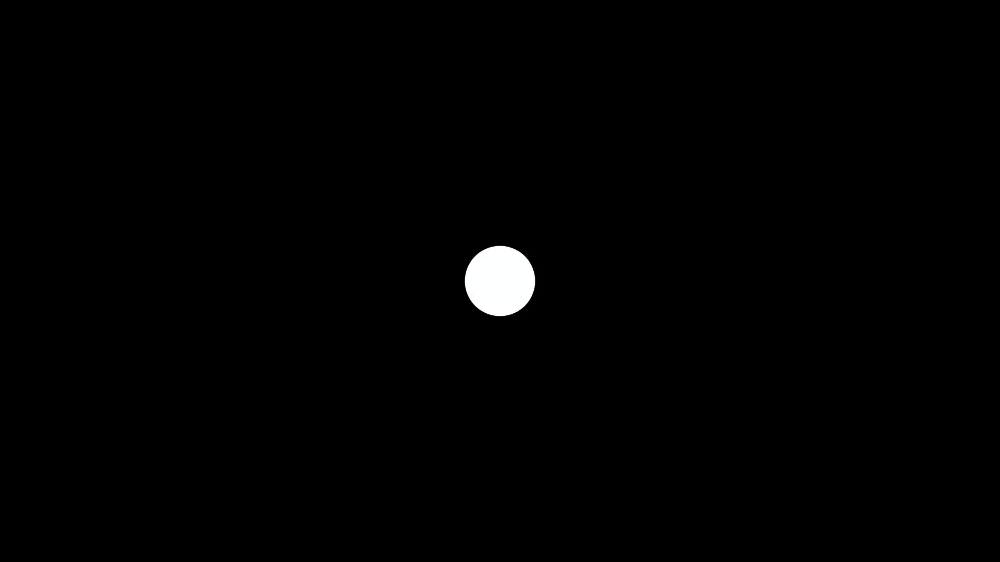
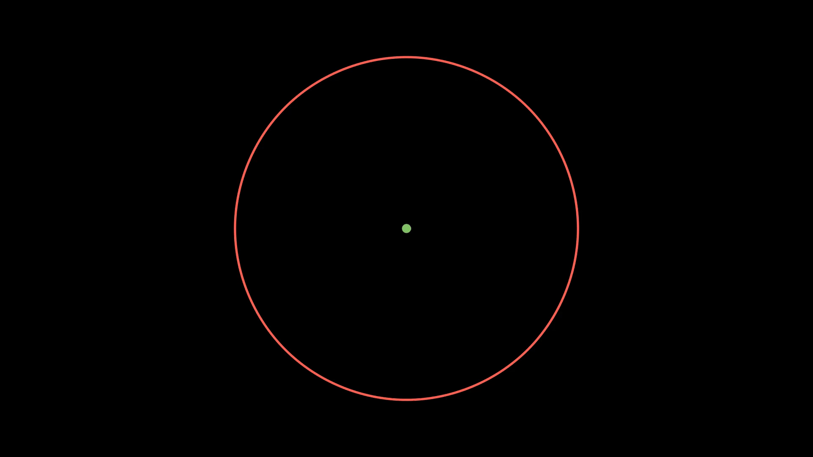

# 3. Grundlagen der Animation

Ein wichtiger bestandteil von Manim ist das Erstellen von Animationen. Dabei gibt es drei wichtige Vorgehensweisen mit denen gearbeitet werden kann um Animationen zu erzeugen. Diese drei Möglichkeiten sollen nun in diesem Kapitel vorgestellt werden.

- Animieren mit vorgefertigten Animations-Klassen
- Animieren mit ```.animate```
- Animieren mit einem ```updater```

Zu beginn ist es wichtig zu wissen das Animationen mit ```self.play()``` zur Szene hinzugefügt werden, ```self.add()``` wird dann nicht mehr benötigt. Dabei kann die Übergabevariable ```run_time``` genutzt werden um die Länge der Animation in Sekunden anzugeben.

## Animieren mit vorgefertigten Animations-Klassen

Manim stellt eine Menge an Animations-Klassen zur verfügung die es einfach machen Animationen zu erstellen und einem eine Menge arbeit abnehmen können. Hier sollen nun drei dieser Klassen vorgestellt werden die besonders wichtig sind, eine vollständige Liste gibt es [hier](https://docs.manim.community/en/stable/reference_index/animations.html).


**Create()/Uncreate()**

Die Animations-Klasse ```Create()``` bietet die Möglichkeit eine Erstellungsanimations für Objekte zu erzeugen. Dazu wird zuerst ein Objekt erzeugt, in diesem Fall ein Kreis, und dann mit ```Create()``` animiert. Um das entfernen eines Objekts zu animieren kann dann die Klasse ```Uncreate()``` verwendet werden. Der Code dafür sieht wie folgt aus:

```python
class basicAnimations(Scene):

    def construct(self):

        circle1 = Circle().move_to(LEFT*2)

        self.play(Create(circle1), run_time=2)

        self.wait(1)

        self.play(Uncreate(circle1))
```
Damit ergibt sich bereits die erste einfache Animation:

 

**Transform**

Mit der Animations-Klasse ```Transform()``` exestiert ein sehr mächtiges Tool zum erstellen von animationen. Grundlegend kann```Transform()``` ein Objekt in ein anderes verwandeln, so ist es beispielsweise möglich die Bewegung eines Objekts zu animieren. Dazu werden zwei Objekte erstellt die sich an unterschiedlichen Positionen befinden. allerdings wird nur das Objekt an der Startposition zu Bild hinzugefügt, in diesem fall mit ```Create()```. Dann werden der ```Transform``` Klasse die beiden Objekte übergeben und die Animation mit ```self.play()``` abgespielt. Das kann zum Beispiel so aussehen:

```python
circle1 = Circle().move_to(LEFT*2)

circle2 = Circle().move_to(RIGHT*2)

self.play(Create(circle1), run_time=2)

self.play(Transform(circle1, circle2))
```

Damit ergibt sich diese Animation:


```Transform()``` Kann allerdings deutlich mehr als nur einfache Bewegungen zu animieren. Es ist zum Beispiel auch möglich Farbveränderungen zu animieren. Der folgende Code zeigt diese Möglichkeit indem Zwei Punkte mit unterschiedlichen Farben erstellt werden und dann mit ```Transform()``` animiert werden.

```python
dot1 = Dot(color=BLUE)

dot2 = Dot(color=GREEN).move_to(LEFT*2)

self.play(Transform(dot1, dot2))
```

Die animation sieht dann so aus:


Wie zu sehen ist können mit ```Transform()``` einfach animationen erzeugt werden. Die stärke der ```Transform()``` Klasse liegt allerdings vorallem darin sehr leich auch Animationen zu erstellen die aus verschiedenen Teilen bestehen. Um dies zu zeigen wird nun der Code der beiben zuvor gezeigten Animationen kombiniert und der folgende Code hinzugefügt:

```python
self.play(Transform(circle1, dot1))

self.play(Transform(circle1, circle2))
```

Dieser Code verwandelt zuerst den roten Kreis aus Animation 1 in den grünen Punkt von Animaiton 2 und dann wieder zurück. Das sieht dann so aus:


## Animieren mit ```.animate```

Die Animations-Klassen nehmen einem eine Menge arbeit ab wenn Komplexere Animationen erzeugt werden sollen. Für sehr einfache Animationen bei denen nur wenig passiert, zum Beispiel eine einfach Bewegung eines Objekts, sind sie allerdings etwas zu aufwendig. Auf die meisten Methoden (z.B. ```shift()```, ```next_to()```, ```move_to()```, ```set_color()```, ...) eines Objekts kann auch über die ```.animate``` Syntax zugegriffen werden. Dies führt dazu das alle damit aufgerufenen Methoden animiert werden. Um ein Objekt zu bewegen wird zum Beispiel nur der folgende Code benötigt: 

```python
dot3 = Dot(radius=0.5)

self.play(dot3.animate.move_to(LEFT*4))
```



Eine einfache farbveränderung sehe so aus:

```python
dot3 = Dot(radius=0.5)

self.play(dot3.animate.set_color(GREEN))
```



Allerdings können mit ```.animate``` nicht nur diese sehr einfachen Animationen erstellt werden, es können auch mehrere Ereignisse aufeinmal animiert werden, dabei sollte man sich allerdings immer überlegen ob es nicht einfacher ist eine vorgefertigte animations-Klasse zu verwenden. Mit dem folgenden Code wird ein Objekt bewegt gleichzeitig die Farbe verändert:

```python
dot3 = Dot(radius=0.5)

self.play(dot3.animate.move_to(LEFT*4).set_color(GREEN))
```



## Animieren mit einem ```updater```

Der Updater ist das wohl mächtigste aber auch Komplexeste Animationstool von Manim, er ermöglicht die aufwendigsten Animationen benötigt dabei aber selbst für einfach animationen relativ viel Code. Ein Updater kann einem Objekt mit ```.add_updater()``` hinzugefügt werden. Eine einfache bewegung eines Objekts sieht dabei Beispielsweise so aus:

```python
newDot = Dot(color=GREEN)

moveTracker = ValueTracker(0)

newDot.add_updater(lambda obj: obj.move_to(LEFT*moveTracker.get_value()))

self.add(newDot)

self.play(moveTracker.animate.set_value(3))
```

In dem Code gibt es verschiedene Aspekte die zu beachten sind.

- Neben dem eigentlichen Objekt wird noch ein ```ValueTracker(startValue)``` benötigt.
- Der ```add_updater``` methode wird eine Funktion übergeben, in diesem Fall im Still einer Lambda-Funktion.
- Die eigentliche Animation wird nicht über das Objekt sondern über den ```ValueTracker``` aufgerufen.

Für solche einfachen Animationen bietet sich ein updater damit eher nicht an, allerdings ermöglicht er Animationen die mit den zuvor beschriebenen Möglichkeiten nicht oder nur sehr schwer umsetzbar waren. 


Die folgende animation nutzt einen Updater in verbindung mit den zuvor besprochenen Möglichkeiten um eine etwas komplexere Animation zu erzeugen die ohne den Updater nicht möglich wäre:



Zuerst werden die benötigten Objekte erzeugt:

```pyhton
newDot = Dot(color=GREEN)

newCircle = Circle(radius=3, color=RED)

self.add(newDot, newCircle)

line = Line(ORIGIN, newDot)
```

Als nächstes wird das verhalten der Linie definiert und die Linie dem Bild hinzugefügt. Dabei wird dieses mal kein ValueTracker benötigt da keine veränderung einer Variable von außen benötigt wird. Die veränderung der Linie orientiert sich schlicht an dem Punkt.

```python
line.add_updater(lambda line: line.become(Line(ORIGIN, newDot)))

self.add(line)
```

Wie zu sehen ist wird die exestierende Linie mit der Methode ```.become()``` zu einem neuen Objekt verwandelt. Dieses neue Objekt ist allerdings wieder eine Linie, nur eben an einer anderen Position. Damit ist der schwierigste Teil bereits geschaft.

Nun muss nurnoch die bewegung des Punktes Animiert werden. Dank der Animations-Klasse ```MoveAlongPath(objectToMove, PathToMoveAlong)``` ist sehr einfach:

```python
self.play(newDot.animate.shift(RIGHT*3))

self.play(MoveAlongPath(newDot, newCircle), run_time=6)

self.play(newDot.animate.move_to(ORIGIN))
```

Damit ist die Animation bereits fertig. Wie zu sehen ist sind die besten Ergebnisse zu erziehlen wenn alle drei möglichkeiten kombiniert werden.
