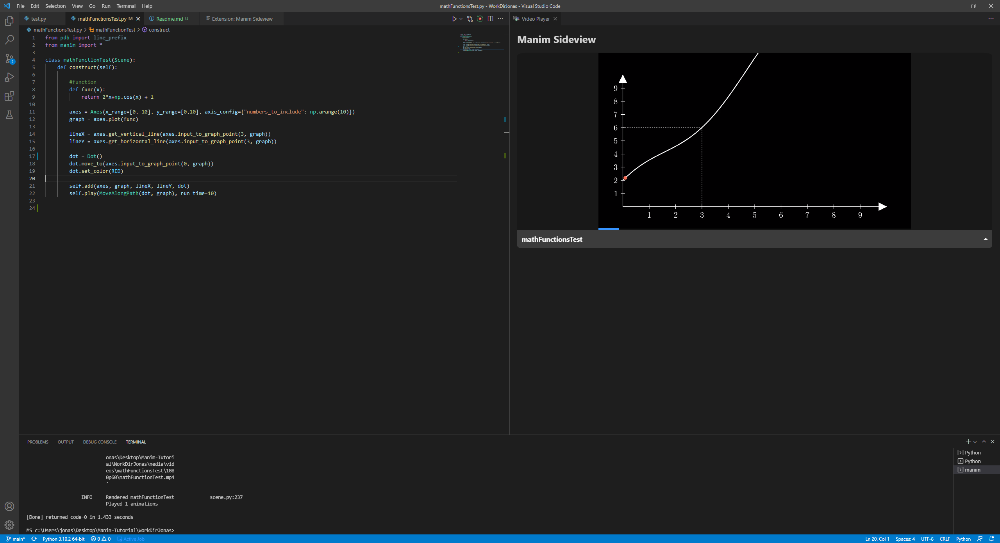
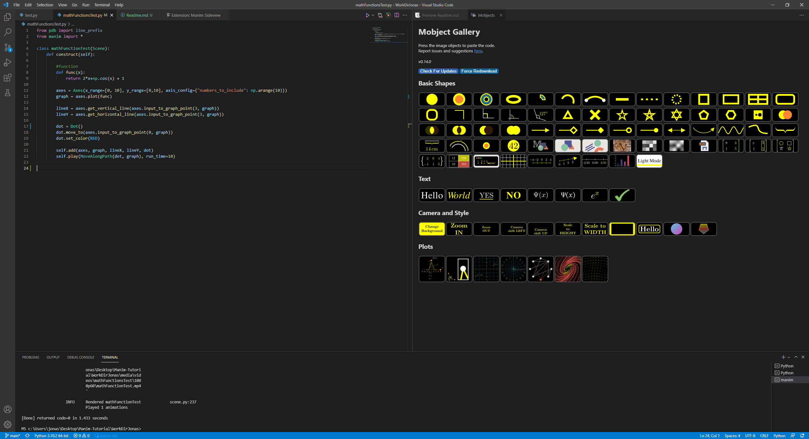
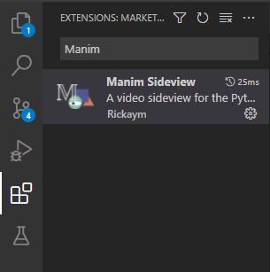

# Vorbereitung
Für dises Projekt wird die Community-Version von Manim verwendet welche [hier](https://github.com/ManimCommunity/manim) zu finden ist. 


**1. Manim installieren**
**2. LaTeX installieren [optional - Empfohlen]**
**3. Visiual Studio Code Plugin installieren [optional]**


## 1. Manim installieren
**Windows - Chocolatey**
Die installation unter Windows ist am einfachsten über den "Chocolatey" package manager. Dieser kann über die Windows PowerShell installiert werden indem die folgenden Schritte durchgeführt werden: 
1. PowerShell mit Administrator rechten starten
2. Ausführen des folgenden Befehls: ```
   Set-ExecutionPolicy Bypass -Scope Process -Force; [System.Net.ServicePointManager]::SecurityProtocol = [System.Net.ServicePointManager]::SecurityProtocol -bor 3072; iex ((New-Object System.Net.WebClient).DownloadString('https://community.chocolatey.org/install.ps1')) ```
3. Mit ```choco -?``` überprüfen ob die installation funktioniert hat

Nachdem Chocolatey installiert wurde, kann Manim mit allen benötigten abhängigkeiten mit dem Befehl ```choco install manimce```  Installiert werden.

**Windows - manuell**
Eine Manuelle installation von Manim ist ebenfalls möglich. Dies ist allerdings etwas aufwendiger. Der ablauf sieht wie folgt aus:
1. Python installieren. Manim setzt Python 3.7-3.9 vorraus, andere Versionen von Python sind nicht mit Manim Kompatibel. Python kann auf https://www.python.org/downloads/ herruntergeladen werden.
2. FFmpeg installieren.
   1. FFmpeg [Herrunterladen](https://www.gyan.dev/ffmpeg/builds/ffmpeg-release-essentials.7z)
   2. Entpacken und in einen permanenten Ordner verschieben (zum Beispiel C:\Programme\)
   3. Ordnerpfad zum PATH hinzufügen (windows suche nach "systemumgebungsvariablen bearbeiten"-> "umgebungsvariablen...")
   4. In einem neuen Terminal überprüfen ob ```ffmpeg``` akzeptiert wird.
3. Manim über pip mit folgendem Befehl installieren: ```python -m pip install manim```
4. In einem neuen Terminal überprüfen ob ```manim``` akzeptiert wird.

Es ist möglich das ```manim``` trotz korrekter installation nicht akzeptiert wird, dann wurde Python vermutlich nicht korekkt eingerichtet und es ist nötig den manim Installtionsordner zu finden und ebenfalls zum PATH hinzuzufügen. 

**Linux - Debian - apt**
Für die installation unter Debian und allen darauf aufbauenen Distributionen (z.B. Ubuntu) werden die folgenden Befehle ausgeführt:
1. ```sudo apt update```
2. ```sudo apt install libcairo2-dev libpango1.0-dev ffmpeg```
3. ```pip3 install manim```

Python sowie pip sollten bereits vorinstalltiert sein. Ist dies nicht der Fall muss zuerst python und pip installiert werden.

**Linux - Red Hat Linux - dnf**
Für die installation in Distributionen die auf Red Hat Linux aufbauen (z.B. RHEL/Fedora/CentOS) werden die folgenden Befehle ausgeführt:

1. ```sudo dnf install cairo-devel pango-devel```
2. ```sudo dnf install python3-devel```
3. ```sudo dnf install ffmpeg```
4. ```pip3 install manim```

Python sowie pip sollten bereits vorinstalltiert sein. Ist dies nicht der Fall muss zuerst python und pip installiert werden.

## 2. LaTeX installieren [optional - Empfohlen]
LaTeX wird nicht zwingend benötigt um Manim zu verwenden, um allerdings den vollen Funktionsumfang von Manim nutzen zu können wird LaTeX benötigt.

**Windows - Chocolatey**
Unter Windows wird empfohlen die MiKTeX zu verwenden. Wurde zuvor Chocolatey installiert kann MiKTeX mit dem Befehl ```choco install miktex.install``` installiert werden. Dabei gilt es darauf zu achten das der Befehl als Administrator ausgeführt werden muss.

**Windows - manuell**
Unter Windows wird empfohlen die MiKTeX zu verwenden. Um MiKTeX manuell zu installieren wird der Installer von der [MikTeX Webseite](https://miktex.org/download) herruntergeladen. Anschließend müssen die Schritte im Installer durchgeführt werden.

**Linux - Debian - apt**
Für die Installation mit apt wird ```sudo apt-get install texlive-full ``` ausgeführt.

**Linux - Red Hat Linux - dnf**
Für die Installation mit dnf wird ```sudo dnf install texlive-scheme-full ``` ausgeführt.

#3. Visiual Studio Code Plugin installieren [optional]
Prinzipiell kann jeder belibige Code-Editor verwendet werden um Manim Programme zu schreiben. VS Code bietet gegenüber anderen Editoren den Vorteil das es eine sehr große Plugin-Community gibt. So gibt es aus ein Manim Plugin für VS Code. Das Plugin ermöglicht eine sehr einfache visualisierung des Programms indem automatische Manim ausgeführt wird und die ausgabe dierekt in VS Code angezeigt wird ohne den Editor verlassen zu müssen.





Außerdem bietet das Plugin die Möglichkeit verschiedenen Elemente auszuwählen und die entsprechenden Codeteile einzufügen, was hilfreich sein kann wenn man Manim erstmalig kennenlernt.




**Installation**
Zur Installation des Plugins wird im VS Code Extension Menü nach "Manim" gesucht und die Erweiterung "Manim Sideview" ausgefählt.





Wurde das Plugin gefunden wird es mit einem Klick auf "install" installiert.

**Einrichtung**
Um die Erweiterung nutzen zu können muss eine Konfigurationsdatei namens "manim.cfg" angelegt werden. Die Datei muss im gleichen Verzeichniss wir die python-Datein liegen. Die Datei muss mit ```[CLI]``` beginnen. Es sollten folgende Dinge konfiguriert werden: "output_file", "manim-sideview.videoDirectory", "manim-sideview.commandLineArgs". 
Die Datei sollte etwa so aussehen:
```
[CLI]
output_file = meineScene
manim-sideview.videoDirectory = .\media\videos\{module_name}\1080p60
manim-sideview.commandLineArgs = -qh
```
