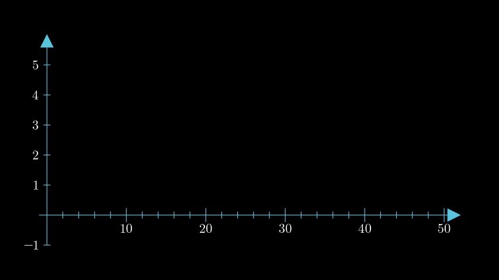

# Funktionen darstellen
Die möglichkeit mathematische Funktionen darzustellen ist ein wichtige bestantteil von Manim. Dementsprechend stehen eine vielzahl an Möglichkeiten zur verfügung alle möglichen Funktionen zu visualisieren. Dabei unterscheidet sich die darstallung von Funktionen von den Klassischen visualisierungen in Manim da hier vorallem auch die entsprechenden Funktionen definiert werden müssen. 

In diesem Teil des Tutorials soll Manim's möglichkeiten zu visualiesierung von Funktionen dargestellt werden. Dabei werden im speziellen drei Dinge besprochen:
1. Visualisierung von zweidimensionalen Funktionen in einem einfachen Koordinatensystem
2. Darstellung von zweidimensionalen Funktionen in einem Koordinatensystem mit Kamerabewegungen
3. Abbilden von dreidimensionalen Funktionen

Mithilfe dieser drei Teile sollte es möglich sein die meisten Projekte umzusetzen die auf der darstellung von Funktionen basieren.

## 1. Visualisierung von zweidimensionalen Funktionen in einem einfachen Koordinatensystem
In diesem Teil des Tutorials werden die Grundlagen für das Arbeiten mit Funktionen dargestellt. Dabei werden folgende bereiche behandelt:
- erstellung eines Koordinatensystems
- darstellung einer Funktion
- Hervorheben/Markieren eines speziellen Punktes einer Funktion
- Markieren eines von einer Funktion eingeschlossenen Bereichs

Ziel ist es folgende Grafik zu erstellen:


Als erstes macht es Sinn ein Koordinatensystem zu erzeugen in dem anschließend Gleichungen dargestellt werden können. Zu diesem Zweck kann die Funktion ```Axes()``` verwendet werden. Dabei sind die Übergabeparameter ```x_range``` und ```y_range``` entscheident um die größe des Koordinatensystems zu definieren. Ihnen wird jeweils ein Array nach dem schema ```[start, ende, intervall]``` zugeordnet. Mit diesem einfachen Code kann bereits ein einfaches Koordinatensystem erzeugt werden. 
```python
class twoDFuntion(Scene):

    def construct(self):
        #Koordinatensystem Erzeugen
        axes = Axes(
            x_range=[-1, 52, 2],
            y_range=[-1, 6, 1])
```
Das Koordinatenssystem sollte nun so aussehen:


So ist das Koordinatenssystem allerdings noch nicht wirklich zu gebrauchen. Im folgenden muss es Konfiguriert werden. Dazu stehen in erster Linie die folgenden drei Übergabeparameter bereit: ```axis_config```, ```x_axis_config```, ```y_axis_config```. Diesen parametern können dictionarys nach folgendem Schema zugeordnet werden ```{"Parameter": Value, "Parameter2": Value2, ...}```. Parameter die für beide Achsen gesetzt werden sollen könnnen mit ```axis_config``` konfiguriert werden. Mit ```x_axis_config``` und ```y_axis_config``` wird nur jeweils ein Achse verändert.

Eine vollständige Liste aller möglichen Parameter ist [hier](https://docs.manim.community/en/stable/reference/manim.mobject.number_line.NumberLine.html#manim.mobject.number_line.NumberLine) in der Manim-Dokumentation zu finden. Für uns sind hier allerdings nur eine wenige Parameter interessant. Erstens soll die Farbe des Koordinatensystems geändert werden, dazu wird der Parameter ```"color": BLUE``` definiert. Zweitens sollen die Achsen mit entsprechenden Zahlen beschriftet werden um das Koordinatensystem aussagekräftiger zu machen. Dafür wird der Parameter ```"numbers_to_include": [Iterable[float]]```  verwendet. Diesem kann beispielsweise ein Array mit Integern zugewiesen werden. Zur vereinfachung kann allerdings auch die Funktion ```arrange(min, max, interval)``` von numpy verwendet werden, diese erzeugt ein entsprechendes Array automatisch. Das könnte dan zum Beispiel so aussehen: ```y_axis_config={"numbers_to_include": np.arange(-1, 6)}```. Dabei ist wichtig zu wissen das die ```np.arrange()``` die obere Grenze nicht mit in das Array aufnimmt, diese sollte deshalb um 1 höher definiert werden als eigentlich benötigt. Die vollständige definition der Übergabeparameter sieht nun so aus:

```python
axes = Axes(
    x_range=[-1, 52, 2],
    y_range=[-1, 6],
    axis_config={"color": BLUE},
    x_axis_config={"numbers_to_include": np.arange(0, 51, 10)},
    y_axis_config={"numbers_to_include": np.arange(-1, 6, 1)})
```

Mit der gezeigten veränderung wurde nun auf der X-Achse die Beschrifung 10, 20, 30, 40, 50 hinzugefügt und auf der Y-Achse die Beschriftung 1, 2, 3, 4, 5. Auserdem wurden die Achsen Blau gefärbt. Dar auf der X-Achse nur in Zehnerschritten beschriftet wurde, wird hier noch ein weitere Parameter festgelegt. Mit ```"numbers_with_elongated_ticks": [Iterable[float]]``` können bestimmte Striche auf den Achsen hervorgehoben werden. Dies wird nun mit ```"numbers_with_elongated_ticks": np.arange(0, 51, 10)``` für alle Beschriftungen des X-Achse definiert.

Das Koordinatensystem sieht nun wie folgt aus:



Nachdem nun das Koordinatensystem erstellt und konfiguriert wurde kann jetzt eine Gleichung darin dargestellt werden.
Grundlegend wird dazu die Funktion ```plot()``` verwendet die Teil der des gerade erstellten Koordinatensystems ist. Dabei sind zwei Übergabeparameter entscheident. Einerseits muss die eigentliche Gleichung übergeben werden und andererseits die X-Werte für die die Gleichung berechnet werden soll. Die einfachste Methode dafür ist die Gleichung in-line als Lambda Funktion zu definieren. So zum Beispiel: ```lambda x: np.log(x)```. Die vollständige Definition des Graphen für die Gleichung "f(x) = log(x)" sieht damit beispielsweise so aus:

```python
logGraph = axes.plot(lambda x: np.log(x), x_range=[0.1, 51], color=RED)
```

Wichtig ist hier das die X-Werte erst ab 0.1 beginnen da log(0) nicNt definiert ist. Wird dieser Code ausgeführt erhält man folgends Ergebniss:


Mit dieser Methode ist es möglich sehr einfach Gleichungen darzustellen. Allerdings bietet diese Methode auch nachteile. So kann die Gleichung nicht dierekt weiterverwendet werden und ist auch nicht leich austauschbar, außerdem wird es bei längeren Gleichungen schnell unübersichtlich. Diese Methode bietet sich an wenn es sich um einfache Gleichungen handelt bei denen bereits vorher klar ist dass mit der Gleichung nicht mehr weiter gearbeitet werden muss.

Deutlich vielseitiger ist die Definition der Gleichung als eigene Funktion im Code. Im folgenden soll nun mit dieser Methode zusätzlich die Gleichung "g(x) = (x-25)<sup>2</sup>" dargestellt werden. Dazu wird zuerst die Gleichung als Funktion definiert.

```python
def powerOf2(x):
    return (x-25)**2
```

Anschließend wird wider die ```plot``` Funktion verwendet, dabei wird diesmal allerdings einfach ein Funktionpointer übergeben.

```python
powerOf2Graph = axes.plot(powerOf2, x_range=[22, 28], color=GREEN)
```
Mithilfe dieses Codes sieht die Grafig nun so aus:


Die verwendung dieser Methode ist deutlich vielsseitiger und übersichtlicher, allerdings auch etwas aufwendiger. Die Wahl der besten Methode für die Definition von Gleichungen ist immer von der jeweiligen Situation abhängig.

Nachdem nun die Grundlagen für das Visualisieren von Gleichungen dargestellt wurde soll nun ein bestimter Punkt auf dem Roten Graphen Markiert werden genaugenommen der Punkt "f(25)". Dazu bieteten Koordinatensysteme zum Beispiel die Funktion ```get_lines_to_point()``` der Koordinaten übergeben werden müssen. Um diese Funktion nutze zu können müssen nun allerdings erst die Koordinaten gefunden werden indem "f(25)" berechnet wird. Da wir die Gleichung bereits dargestellt und berechnet haben kann über ```cords = axes.input_to_graph_point(x, graph)``` auf die Ergebnissse zugegriffen werden. Die damit gefundenen Koordinaten werden schließlich in ```get_lines_to_point(cords)``` eingesetzt. In umserem Beispiel sieht das dann so aus:
```python
logGraph = axes.plot(lambda x: np.log(x), x_range=[0.1, 51], color=RED)

cords = axes.input_to_graph_point(25, logGraph)
lines = axes.get_lines_to_point(cords, color=BLUE)
```
Das Ergebniss ist dann Folgendes:


Zu guterletzt soll nun noch der Bereich zwischen den beiden Funktionen herrvorgehoben werden. Prinzipiel gibt es dafür die Funktion ```axes.get_area(graph1, bounded_graph=graph2)```. Eine naive implementierung dieser Funktion sehe dann so aus: 
```
area = axes.get_area(powerOf2Graph, bounded_graph=logGraph)
```
Dies liefert folgendes Ergebniss:


Prinzipiell Funktioniert das gut, aber was nun wenn nur der Bereich unter dem roten Graphen hervorgehoben werden soll? Dazu kann der ```axes.get_area()``` Funktion ein Parameter ```x_range=[min, max]``` übergeben werden. Das finden der Schnittpunkte übernimmt Manim leider nicht. Eine eigene Implementierung ist allerdings nicht besondres schwierig und kann zum Beispiel mit der Funktion ```fsolve``` aus der Bibliothek ```scipy.optimize``` durchgeführt werden. 

So zum Beispiel:

```python
from scipy.optimize import fsolve

def findIntersection(function1, function2, x0):
    return fsolve(lambda x: function1(x) - function2(x), x0)

firstIntersectX = findIntersection(powerOf2, np.log, 23)
secondIntersectX = findIntersection(powerOf2, np.log, 26)
```

Dies ist eine Recht einfache Umsetztung der gebrauchten Funktionalität die immer nur den nächsten Schnittpunkt, basierend auf einem übergebenen Schätzwert, liefert. Eine Vollautomatisierung ist damit nicht gegeben, für unsere Zwecke reicht es allerdings vollkommen aus. Dabei ist hier der zuvor angesprochene Vorteil einer Definition der Gleichungen als eigene Funktion zu sehen. Während die Gleichung "g(x) = (x-25)<sup>2</sup>" einfach wieder mit einem Funktionpointer übergeben werden kann muss die Gleichung "f(x) = log(x)" mit ```np.log``` neu definiert werden.

Nun muss nurnoch der ```x_range``` Parameter mit den gefundenen Schnittpunkten festgelegt werden:
```python
area = axes.get_area(powerOf2Graph, bounded_graph=logGraph, x_range=[firstIntersectX, secondIntersectX], color=GREY)
```


Damit ist nun das Ziel des ersten Teils erreicht und die Grundlagen der Visualisierung von Gleichungen klar. Der vollständige Code für das Erzeugen der Grafik findet sich in der Datei "2dFuntion.py".

## 2. Darstellung von zweidimensionalen Funktionen in einem Koordinatensystem mit Kamerabewegungen
In diesem zweiten Teil des Tutorials soll es in erster Linie um die Implementierung von Kamerabewegungen gehen Ziel ist es das folgende Video zu erstellen:


Die erstellung des Koordinatensystem unterscheidet sich kaum vom ersten Teil:

```python
plane = NumberPlane(
    x_range=[-10, 10, 1],
    y_range=[-5, 5, 1],
    axis_config={"color": BLUE},
    x_axis_config={"numbers_to_include": np.arange(-10, 11, 1)},
    y_axis_config={"numbers_to_include": np.arange(-5, 6, 1)})
```

Anstatt der ```Axis()``` Klasse wird nun allerding ein ```NumberPlane()``` erstellt. Diese bietet eine etwas andere Visualisierung unterscheidet sich sonst aber nur wenig von dem ersten Beispiel.

Auch die Implementierung der Funktionen läuft ab wie zuvor:

```python
sinGraph = plane.plot(lambda x: np.sin(x), color=GREEN)
cosGraph = plane.plot(lambda x: np.cos(x), color=TEAL)
```

Und sieht dann wie folgt aus:


Der neue Teil ist in erster Linie die Bewegung der Kamera zur Fokusierung auf verschiedenen Teile der Grafik. Das ist prinzipiel recht einfach aber es müssen einige Dinge beachtet werden. Einerseits muss die Klassen signatur angepasst werden. 

Statt einer normalen "Scene" wird nun eine "MovingCameraScene" verwendet:
```python
class twoDFuntion(Scene):
``` 

wird zu 

```python
class twoDFuntionWithPlane(MovingCameraScene):
```

Durch diese Veränderung kann man über ```self.camera.frame``` auf die Kamera zugreifen. Speziell steht unter ```self.camera.frame.animate``` die Möglichkeit der Animation der Kamera bereit. Zur Bewegung können die Klassischen Bewegungsfunktionen wie ```move_to()``` oder ```shift()``` verwendet werden. Um rein- oder raus zu Zoomen kann Beispielsweise folgende Funktion genutzt werden: ```set(width=neueWidth)```. Zusätzlich ist es möglich mit ```self.camera.frame.save_state()``` eine Kameraeinstellung zu speichern und mit ```self.play(Restore(self.camera.frame))``` wiederherzustellen. Mit diesen einfachen Befehelen kann die Kammera in einer vielzahl an Wegen über das Koordinatensystem bewegt werden.

Die Animation vom Anfang wird zu Beispiel so erzeugt:

```python
#Position speichern
self.camera.frame.save_state()
#2,5 Sekunden warten
self.wait(2.5)
#Kamera 10 Schritte nach rechts Bewegen
self.play(self.camera.frame.animate.shift(RIGHT*10))
#Herranzoomen (um den Faktor 2)
self.play(self.camera.frame.animate.set(width=self.camera.frame.width/2))
#2,5 Sekunden warten
self.wait(2.5)
#Kamera zurücksetzen
self.play(Restore(self.camera.frame))
#Kamera 10 Schritte nach links Bewegen
self.play(self.camera.frame.animate.shift(LEFT*10))
#2,5 Sekunden warten
self.wait(2.5)
#Kamera zurücksetzen
self.play(Restore(self.camera.frame))
#Herrauszoomen auf die doppelte Größe des Koordinatensystems
self.play(self.camera.frame.animate.set(width=plane.width*2))
#Kamera zurücksetzen
self.play(Restore(self.camera.frame))
```

## 3. Abbilden von dreidimensionalen Funktionen
Auch dreidimensionalen Funktionen können Problemlos mit Manim dargestellt werden. Der Ablauf unterscheidet sich dabei nur kaum von der Visualisierung zweidimensionaler Funktionen.

Erstellt werden soll die folgende Grafik welche die Gleichung "f(x, y) = sin(x)*cos(y)" visualisiert:


Ähnlich wie schon in Teil zwei muss die Klassensignatur angepasst werden. Es wird nun eine ```ThreeDScene``` verwendet

```python
class twoDFuntion(Scene):
```
wird zu

```python
class threeDFunction(ThreeDScene):
```

Zuerst wird wieder das Koordinatensystem erzeugt:
```python
axes = ThreeDAxes(
    x_range=[-10, 10, 1],
    y_range=[-10, 10, 1],
    z_range=[-10, 10, 1],
    axis_config={"color": RED, "numbers_to_include": np.arange(-10, 11, 1), "include_tip": False, "font_size": 20})
```
Wie zu sehen ist lauft die gleich ab wie zuvor, mit dem einen Unterschied das es jetzt natürlich noch einen Z-Achse gibt.


Um das Ergebniss besser sehen zu können wird die Kamera gedreht:
```python
self.set_camera_orientation(phi=45*DEGREES, theta=45*DEGREES)
```


Als nächstes wird die Gleichung definiert:

```python
def threeDFunc(u, v):
    z = np.sin(u) * np.cos(v)
    return np.array([u, v, z])
```

Der hauptsächliche Unterschied zu den zweidimensionalen Funktionen zeigt sich im nächsten schritt. Um die Gleichung darzustellen muss ein ```Surface()``` erstellt werden. Dazu wird dem Konstruktor der Klasse die Gleichungsfunktion sowie eine u_range (x) und eine v_range (y) übergeben:

```python
graph = Surface(threeDFunc, u_range=[-5, 5], v_range=[-5, 5], fill_opacity=0.5)
```

Zur besseren Darstellung wird die Obefläsche außerdem mit ```fill_opacity=0.5``` Transparent gemacht.


Wie zu sehen ist, ist auch die Darstellung von dreidimensionalen Funktionen nicht schwierig und kann problemlos mit wenigen Codezeilen umgesetzt werden. 
