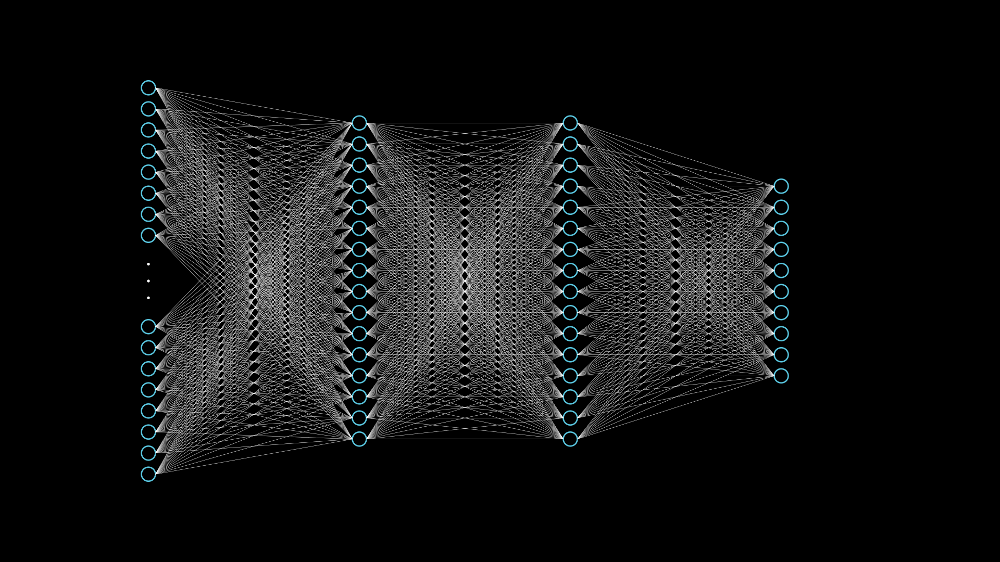

# 5. 3Blue1Brown - KNN
Nachdem in den vorherigen Kapiteln verschiedene Grundlagen dargestellt wurden, sollen diese nun verbunden werden um komplexere Szenen zu erstellen. Als vorlage dienen dafür Grafiken aus den Videos von 3Blue1Brow auf YouTube.
In diesem Kapitel soll eine Visualisierung eines einfachen künstlichen neuronalen Netzes erzeugt werden.

Vorlage: 3Blue1Brown - [But what is a neural network? | Chapter 1, Deep learning](https://www.youtube.com/watch?v=aircAruvnKk&t=103s) [Zeit: 1:43-2:05]

Ziel dieses Kapitels ist das Erstellen des folgenden Videos:

https://user-images.githubusercontent.com/50620058/152992613-4eec1536-6a23-4994-9444-9d7e46e7034d.mp4

Das erstellen dieser Szene kann grob in 4 Abschnitte unterteilt werden:
1. Erstellen der Knotenpunkte (Kreise)
2. Erstellen der Kanten (Linien zwischen Knoten)
3. Animieren der Knoten und Kanten
4. Einfügen von Details (Klammer, Beschriftung, hervorhebung)

Dabei wird neben den bereits bekannten Konzepten auch die neue Funktionalität der ```VGroup``` eingeführt. Eine ```VGroup``` ermöglicht es mehrere Objekte zu verbinden und gemeinsam zu bearbeiten.

## 1. Erstellen der Knotenpunkte
Zuerst sollen die Knotenpunkte erstellt werden welche die künstlichen Neuronen des Netzes darstellen. Dabei solle es vier Schichten schichten geben: eine Input-Schicht mit 784 Knoten, zwei versteckte-Schichten mit je 16 Knoten und eine output-Schicht mit 10 Knoten.

Die Einzelnen Knoten werden mithilfe der ```Circle()``` Funktion erzeugt. Dabei müssen die folgenden drei Eigenschaften angepasst werden: ```stroke_color```, ```stroke_width``` und ```radius```. In diesem Fall habe ich mich für einen Radius von 0,1 und eine ```stroke_width``` von 2 enschieden, außerdem werden die Kreise in Blau dargestellt.

```python
circleRadius = 0.1
circleStrokeWidth = 2
circleCollor = BLUE

newCircle = Circle(stroke_color=circleCollor, stroke_width=circleStrokeWidth, radius=circleRadius)
```
Daraus ergibt sich der folgende Kreis:


Für die Grafik werden natürlich deutlich mehr Kreise benötigt. Beginnen wir damit eine einzelne Schicht des knn zu erstellen. Dazu wird eine einfach for-Schleife verwendet und die neuen Kreise mit jeder Iteration weiter nach unter verschoben. Dazu kann die ```shift```  Funktion verwendet werden. Das sieht dann etwa so aus:
```python
circleRadius = 0.1
circleStrokeWidth = 2
circleCollor = BLUE

spacingMultiplier = 0.3

for i in range(16):
    newCircle = Circle(stroke_color=circleCollor, stroke_width=circleStrokeWidth, radius=circleRadius)
    #arrange node
    newCircle.shift(DOWN*i*spacingMultiplier)
    #draw node
    self.add(newCircle)

```
Wie zu sehen ist wurde hier zusätzlich noch die Variable "spacingMultiplier" eingeführt, mit dieser kann der Abstand zwischen den Kreise verändert werden. Da dieser standarmäßig recht groß ist wird hier ein Multiplikator von 0,3 eingesetzt. Außerdem werden die Kreise mit ```self.add(newCircle)``` jeweils zur Grafik hinzugefügt.

Damit ergibt sich dieses Bild:


Wie zu sehen ist wurde eine Reihe von Kreisen erzeugt. Diese ist allerdings nicht gut im Bild positioniert. Um die Position der Kreise zu ändern werden diese zu einer ```VGroup``` hinzugefügt. Das ermöglicht es die gesamte Schicht auf einmal zu bewegen, anstatt alle einzeln zu positionieren. Außerdem werden die Kreise nun zu einem Array hinzugefügt, dies ermöglicht es später noch auf jeden einzelnen Kreis zuzugreifen.
Der veränderte Code sieht wie folgt aus:

```python
circleArray = []
group = VGroup()

for i in range(16):
    newCircle = Circle(stroke_color=circleCollor, stroke_width=circleStrokeWidth, radius=circleRadius)
    #arrange node
    newCircle.shift(DOWN*i*spacingMultiplier)
    #draw node
    self.add(newCircle)

    #add node to array
    circleArray.append(newCircle)
    #add node to group
    group.add(newCircle)

#move group to center
group.move_to(ORIGIN)
```

So ergibt sich nun diese Grafik:


Damit wurde nun erfolgreich eine erste Schicht des KNN erzeugt. Es werden allerding vier Schichten benötigt. Dazu wird eine weitere for-Schleife benötigt. Um auch später noch Zugriff auf die einzelnen Kreise sowie die VGroups zu haben werden diese jeweils wieder einem Array hinzugefügt. Dadurch ergibt sich schließlich ein Array mit allen VGroups, sowie ein 2-Dimensionales Array mit allen Kreisen.

```python
nOfRows = 4
rowArray = []
rowGroups = []

for row in range(nOfRows):
    group = VGroup()
    circleArray = []

    for i in range(16):
        newCircle = Circle(stroke_color=circleCollor, stroke_width=circleStrokeWidth, radius=circleRadius)
        #arrange node
        newCircle.shift(DOWN*i*spacingMultiplier)
        #draw node
        self.add(newCircle)
        #add node to array
        circleArray.append(newCircle)
        #add node to group
        group.add(newCircle)
    
    rowArray.append(circleArray)
    rowGroups.append(group)
```

Wie schon zuvor müssen die erzeugten Schichten nun noch Positioniert werden. Dazu werden wieder die VGroups verwendet auf die über ```rowArray``` zugegriffen werden kann:

```python
rowGroups[0].move_to(LEFT*5)
rowGroups[1].move_to(LEFT*2)
rowGroups[2].move_to(RIGHT)
rowGroups[3].move_to(RIGHT*4)
```

Nun sieht die Grafk so aus:


Momentan haben noch alle Schichten die gleiche Größe von 16 Knotenpunkten. Eigentlich sollen die Schichten aber 784 - 16 - 16 - 10 Groß sein. Da es nicht genug Platz gibt um in der ersten schicht 784 Knoten anzuzeigen werden hier einfach 16 Knoten dargestellt und in der Mitte drei Punkte angezeigt welche zeigen das es dort eigentlich noch mehr Knoten gibt.

Zu diesem Zweck wird einfach die untere Hälfte der Kreise der ersten Schicht nach unter bewegt. Dabei ist es wichtig das dies geschiet bevor die Schichten über die VGroups angeordnet werden. Auf die einzelnen Kreise kann über ```rowArray``` zugegriffen werden:

```python
#Create space in first row
for i in range(int(len(rowArray[0])/2), len(rowArray[0])):
    circle = rowArray[0][i]
    circle.shift(DOWN)

rowGroups[0].move_to(LEFT*5)
rowGroups[1].move_to(LEFT*2)
rowGroups[2].move_to(RIGHT)
rowGroups[3].move_to(RIGHT*4)
```

Nun gibt es Platz in der Mitter der ersten Schicht in dem die Punkte eingefügt werden können. Dazu werden drei kleine Punkte erzeugt und untereinander angeordnet. Diese Punkte werden dann wieder einer VGroup hinzugefügt und die Gruppe dann nach Links verschoben:

```python
#add points in first row
rad=0.02
buff=0.2
p1, p2, p3= Dot(radius = rad), Dot(radius = rad), Dot(radius = rad)

p1.next_to(p2, UP, buff=buff)
p3.next_to(p2, DOWN, buff=buff)

dotGroup = VGroup(p1, p2, p3)
dotGroup.move_to(LEFT*5)

self.add(p1, p2, p3)
```

Daraus ergibt sich nun folgendes Bild:


Nachdem jetzt die erste Schicht angepasst wurde musss nun noch die letzte Schicht verändert werden, diese sollte eigentlich nur 10 Knoten enthalten besteht aber akktuell noch aus 16. Ein einfache Weg dies zu lösen und den Code dabei auch noch modularer zu machen ist das ändern der for-Schleife die die Schichten erzeugt. Statt immer fest 16 Knoten zu erzeugen wird nun stattdessen ein Array verwendet in dem die Größe jeder einzelnen Schicht festgelegt ist. Dazu wird zuerst das Array angelegt ```nodesInRows = [16, 16, 16, 10]``` und schließlich die for-Schleife verändert.

```python
for i in range(16):
```

wird zu:

```python
for i in range(nodesInRows[row]):
```

Damit sieht das Bild nun wie folgt aus und die Erstellung der Knotenpunkte ist abgeschloßen.


## 2. Erstellen der Kanten

Nachdem nun alle Knotepukte erstellt wurden müssen jetzt die Kanten erstellt werden. Dazu werden Linien zwischen den Knoten erstellt. Dabei soll jeder Knotenpunkt einer Schicht mit jedem Kontenpunkt der nächsten Schicht verbunden werden. Die grundlegende Idee zur Lösung dieser Aufgabe lässt sich dabei sehr einfach mit folgendem Algorithmus beschreiben:
```
für alle Schichten s außer der letzten:
    für alle Knoten k in s:
        für alle Knoten k2 der nächsten Schicht:
            erzeuge Linie zwischen k und k2
```

Implementiert in unserem Programm sieht das dann so aus:

```python
#Draw lines between nodes
lineStrokeWidth = 0.4

for i in range(nOfRows-1):
    for startCircle in rowArray[i]:
        for endCircle in rowArray[i+1]:
            line = Line(startCircle, endCircle, stroke_width=lineStrokeWidth)
            self.add(line)
```

Damit ergibt sich das folgende Bild:


Das sieht schon ganz gut aus lässt sich aber noch verbessern. Es gibt zwei Probleme:

1. Das Bild ist etwas wirr da die Linien nicht am gleichen Punkt eines Kreises anfangen und aufhören.
2. Wir haben keinen Zugriff mehr auf die einzelnen Linien.

Zur Lösung des ersten Problems kann die Funktion ```point_at_angle(angle)``` eines Kreises verwendet werden um einen speziellen Startpunkt/Endpunkt für die Linien zu finden. Die Implementierung wäre dann folgendes:

```python
lineStrokeWidth = 0.4

for i in range(nOfRows-1):
    for startCircle in rowArray[i]:
        startCirclePointCoords = startCircle.point_at_angle(0*DEGREES)
        
        for endCircle in rowArray[i+1]:
            endCirclePointCoords = endCircle.point_at_angle(180*DEGREES)

            line = Line(startCirclePointCoords, endCirclePointCoords, stroke_width=lineStrokeWidth)
            self.add(line)
```

Das zweite Problem kann ganz einfach wie zuvor bei den Knotenpunkten gelöst werden, indem die Linien mithilfe von Arrays gespeichert werden. Die Strucktur des Arrays ist dann diese: ```rows[nodes[lines[]]]```. Auf die erste Kante des ersten Knoten der ersten Schicht kann dann zum Beispiel so zugegriffen werden: ```lineArray[0][0][0]```. Die Implementierung dieses Konzepts sieht dann so aus:

```python
lineStrokeWidth = 0.4
lineArray = []

for i in range(nOfRows-1):
    linesFromRow = []
    
    for startCircle in rowArray[i]:
        startCirclePointCoords = startCircle.point_at_angle(0*DEGREES)

        linesFromCircle = []

        for endCircle in rowArray[i+1]:
            endCirclePointCoords = endCircle.point_at_angle(180*DEGREES)

            line = Line(startCirclePointCoords, endCirclePointCoords, stroke_width=lineStrokeWidth)
            self.add(line)

            linesFromCircle.append(line)

        linesFromRow.append(linesFromCircle)

    lineArray.append(linesFromRow)
```

Damit sind die Kanten nun vollständig erzeugt und es ergibt sich folgendes Bild:



## 3. Animieren der Knoten und Kanten

Jetzt wo die grundlegende Grafik erzeugt wurde müssen die Animationen hinzugefügt werden.

Die Animationen der Knoten ist eine Farbveränderungen der Füllfarbe der Kreise. Prinzipiell kann die Fullfarbe eines Objekts mithilfe der Methode ```set_fill(color, opacity)``` durchgeführt werden. Damit diese Veränderung allerdings Animiert wird muss zuerst auf ```animate(run_time)``` zugegriffen werden. Um die Veränderung der Füllfarbe zu animieren wird dann beispielsweise folgender Code benötigt: ```animation = object.animate(run_time=2).set_fill(RED, 0.7)```. Zur Auswahl welche Knoten animiert werden und welche nicht gibt es verschiedene möglichkeiten. Es wäre zum Beispiel mögllich die Knote per Hand auszuwählen oder die Knoten mit Zufallszahlen zu bestimmen. In diesem Fall werden allerdings Divisoren verwendet um die Knoten zu bestimmen. Das hat den vorteil das man etwas mehr Kontrolle darüber hat welche Objekte animiert werden und welche nicht. Mit ```i % divisor == 0``` kann bestimmt werden ob ```i``` durch einen Divisor ohne Rest teilbar ist. So ergibt sich die folgende Funktion:

```python
def animateNodeColor (row, divisor1, divisor2, array, color):
    for i in range(len(row)):
        if i % divisor1 == 0:
            array.append(row[i].animate(run_time=2).set_fill(color, 0.7))
        if i % divisor2 == 0:
            array.append(row[i].animate(run_time=2).set_fill(color, 0.7))
```

Wie zu sehen ist werden die Animationen einem Array hinzugefügt anstat sie gleich abzuspieln. Der Grund dafür ist einfach: Die Animationen einer Schicht sollen alle gleichzeitig abgespielt werden, würden die Animationen direkt in der for-Schleife ausgeführt würden diese nacheinander abgespielt werden.

Mithilfe dieser Funktion ist es nun möglich die Knoten-Animationen der ersten drei Schichten zu erzeugen:

```python
nodeAnimationFirstRow = []
nodeAnimationSecondRow = []
nodeAnimationThirdRow = []

animateNodeColor(rowArray[0], 2, 3, nodeAnimationFirstRow, RED)
animateNodeColor(rowArray[1], 3, 5, nodeAnimationSecondRow, RED)
animateNodeColor(rowArray[2], 4, 6, nodeAnimationThirdRow, RED)
```

Da in der Output-Schicht nur ein einziger Knoten animiert werden soll wird dieser per manuell animiert:

```pyhton
nodeAnimationFourthRow = rowArray[3][6].animate(run_time=2).set_fill(RED, 0.7)
```

Um die Animationen auszuführen wird folgender Code verwendet:

```python
self.play(*nodeAnimationFirstRow)
self.play(*nodeAnimationSecondRow)
self.play(*nodeAnimationThirdRow)
self.play(nodeAnimationFourthRow)
```

Es gilt darauf zu Achten das hier der ```*``` Operator verwendet wird um die Arrays zu entpacken. Damit ergibt sich nun folgende Animation:

[VIDEO]

Als nächstes müsssen noch die Kanten animiert werden. Dies läuft grundlegend sehr ähnlich ab wie zuvor bei den Knoten, allerdings wird für das Erzeugen der eigentlichen Animation eine andere Funktion verwendet. Mithilfe von ```ShowPassingFlash(object, run_time, time_width)``` kann eine Animation erstellt werden die nur einen Teil eines Objekts auf einmal zeigt. Das bedeutet das eigentlich nicht die bereits exestierenden Linien animiert werden, sondern jeweils eine neue Linie über den alten Linien erzeugt wird die aber immer nur teilweise zu sehen ist. Dazu können die Linien-Objekte mit ```.copy()``` kopiert werden und dann die Kopien in ```ShowPassingFlash(object, run_time, time_width)``` verwendet werden um die Animationen zu erzeugen. Das könnte dann beispielsweise so aussehen: ```animation = ShowPassingFlash(line.copy().set_color(RED), run_time=2, time_width=1)```. Neben dieser Veränderung funktioniert der Rest wieder genauso wie zuvor:

```python
#line color change
def animateLineColor (nodeArray, divisor1, divisor2, array, color):
    for node in nodeArray:
        for i in range(len(node)):
            if i % divisor1 == 0:
                array.append(ShowPassingFlash(node[i].copy().set_color(color), run_time=2, time_width=1))
            if i % divisor2 == 0:
                array.append(ShowPassingFlash(node[i].copy().set_color(color), run_time=2, time_width=1))


lineAnimationsFirstRow = []        
lineAnimationsSecondRow = []
lineAnimationsThirdRow = []

animateLineColor(lineArray[0], 2, 3, lineAnimationsFirstRow, RED)
animateLineColor(lineArray[1], 3, 5, lineAnimationsSecondRow, RED)
animateLineColor(lineArray[2], 4, 6, lineAnimationsThirdRow, RED)
```

Zur Ausführung der neuen Animationen müssen die exestierenden ```self.play()``` statements angepasst werden:

```python
self.play(*nodeAnimationFirstRow)
self.play(*lineAnimationsFirstRow, *nodeAnimationSecondRow)
self.play(*lineAnimationsSecondRow, *nodeAnimationThirdRow)
self.play(*lineAnimationsThirdRow, nodeAnimationFourthRow)
```

Die fertige Animation sieht dann so aus:

[VIDEO]

## 4. Einfügen von Details (Klammer, Beschriftung, hervorhebung)
